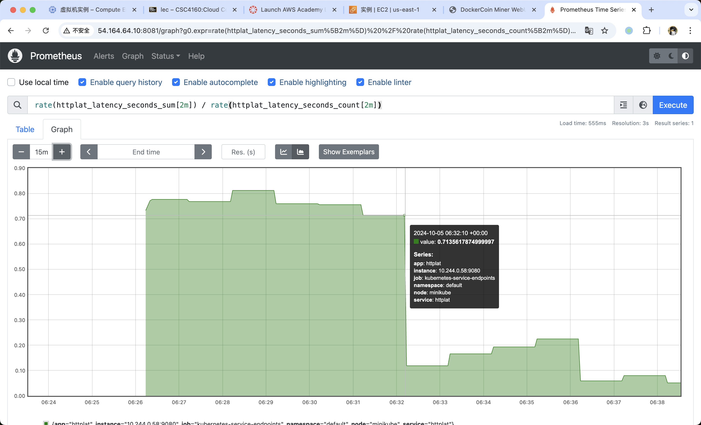
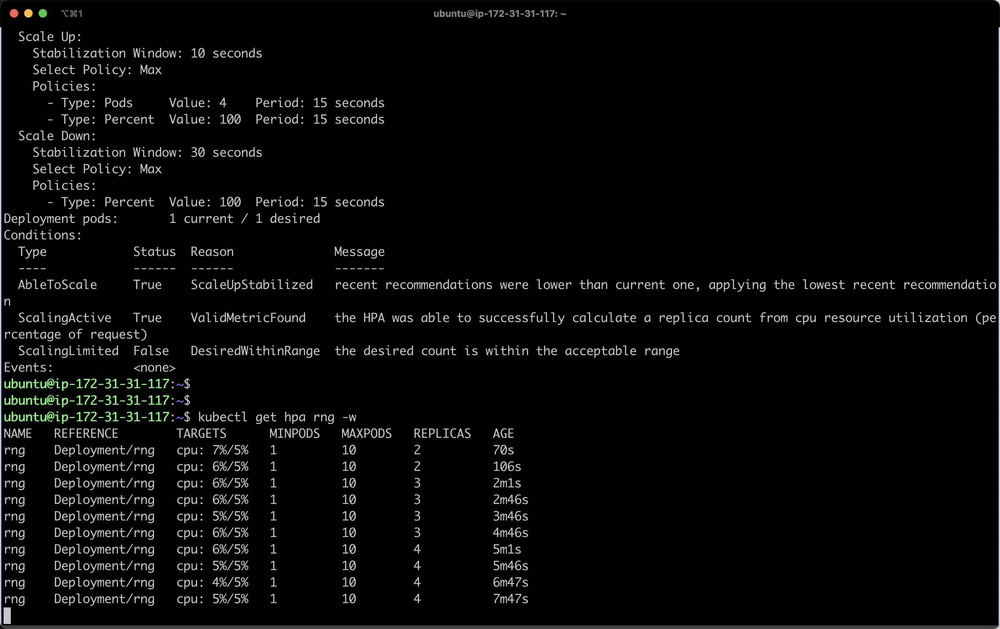

# CSC4160 Assignment 2 (7 points)

### Deadline: October 9, 2024, 23:59

### Name: Wang Chaoren

### Student ID: 122090513

---

## DockerCoins

- DockerCoins is made of 5 services
  - `rng` = web service generating random bytes
  - `hasher` = web service computing hash of POSTed data
  - `worker` = background process calling `rng` and `hasher`
  - `webui` = web interface to watch progress
  - `redis` = data store (holds a counter updated by `worker`)


In this assignment, you will deploy an application called `DockerCoins` which generates a few random bytes, hashes these bytes, increments a counter (to keep track of speed) and repeats forever! You will try to find its bottlenecks when scaling and use HPA (Horizontal Pod Autoscaler) to scale the application. Please follow these instructions carefully!

## Environment Setup

The assignment needs to be setup in `AWS`. You should choose `Ubuntu Server 24.04 LTS (HVM), SSD Volume Type` as AMI (Amazon Machine Image) and `m4.large` as the instance type. And you need to configure security group as followed, to make sure that you can access the service of minikube on the web browser later.

| Type        | Protocol | Port Range | Source    | Description |
| ----------- | -------- | ---------- | --------- | ----------- |
| All traffic | All      | All        | 0.0.0.0/0 |             |

Run the following commands to satisfy the requirements.

```bash
ssh -i /Users/wangchaoren/code/CSC4160/HW1/login.pem ubuntu@54.164.64.10
```

```bash
# Install Minikube
$ curl -LO https://storage.googleapis.com/minikube/releases/latest/minikube-linux-amd64
$ sudo install minikube-linux-amd64 /usr/local/bin/minikube

# Install kubectl
$ curl -LO "https://dl.k8s.io/release/$(curl -L -s https://dl.k8s.io/release/stable.txt)/bin/linux/amd64/kubectl"
$ sudo install -o root -g root -m 0755 kubectl /usr/local/bin/kubectl

# Install Docker
$ sudo apt-get update && sudo apt-get install docker.io -y

# Install conntrack
$ sudo apt-get install -y conntrack

# Install httping
$ sudo apt-get install httping

# Install Helm
$ curl -fsSL -o get_helm.sh https://raw.githubusercontent.com/helm/helm/master/scripts/get-helm-3
$ chmod 700 get_helm.sh
$ ./get_helm.sh
```

## Running Minikube on EC2 Ubuntu

Add user to “docker” group and switch primary group

```bash
$ sudo usermod -aG docker $USER && newgrp docker
```

### Start Minikube

```bash
$ minikube start
```

## Start the application

You can transfer the assignment zip file from your local machine to the EC2 instance and `cd` into the assignment directory.

- Start the application from the `dockercoins` yaml

```bash
$ kubectl apply -f dockercoins.yaml
```

- Wait until all the components are running

```bash
$ kubectl get po
# NAME                      READY   STATUS    RESTARTS   AGE
# hasher-66c759cf4b-b74nz   1/1     Running   0          42s
# redis-5657588f58-mscs6    1/1     Running   0          42s
# rng-846cc46f5b-7x8sc      1/1     Running   0          41s
# webui-78cf59b54c-qjwcx    1/1     Running   0          41s
# worker-75b6469885-mvl2w   1/1     Running   0          41s
```

- Check the results from UI

```bash
$ minikube service webui
# |-----------|-------|-------------|---------------------------|
# | NAMESPACE | NAME  | TARGET PORT |            URL            |
# |-----------|-------|-------------|---------------------------|
# | default   | webui |          80 | http://192.168.49.2:31695 |
# |-----------|-------|-------------|---------------------------|
# 🎉  Opening service default/webui in default browser...
# 👉  http://192.168.49.2:31695
```

- Port forwarding for WebUI

You need to forward connections to a local port to a port on the pod.

```bash
$ kubectl port-forward --address 0.0.0.0 webui-78cf59b54c-qjwcx 8080:80
# Forwarding from 0.0.0.0:8080 -> 80
```

Local port is any number. Pod Port is target port (e.g., 80).

You can access the DockerCoin Miner WebUI on a web browser. The address is <Public IPv4 address>:<local port> (e.g., `3.238.254.199`:`30163`, where `3.238.254.199` is Public IPv4 address of the instance).

_Note_: kubectl port-forward does not return. To continue with the exercises, you will need to open another terminal.


## Bottleneck detection

### Workers

Scale the # of workers from 2 to 10 (change the number of `replicas`).

```bash
$ kubectl scale deployment worker --replicas=3
```

| # of workers  | 1   | 2   | 3   | 4   | 5   | 10  |
| ------------- | --- | --- | --- | --- | --- | --- |
| hashes/second | 0-4 | 4-8 | 4-12| 8-12| 8-10| 10  |

> **Question**: What is the speedup bump when you have 10x workers?
>
> Answer: the speedup bump is ~5x.

### Rng / Hasher

After we scaled to 10 workers, the speed bump is not 10x! Something is slowing us down... But what?

Let's keep the number of workers as `10` and use the good old `httping` command for latency detection. Possible bottlenecks for now are `rng` and `hasher`.

```bash
# Expose the service, since we are detecting the latency outside the k8s cluster
$ kubectl expose service rng --type=NodePort --target-port=80 --name=rng-np
$ kubectl expose service hasher --type=NodePort --target-port=80 --name=hasher-np

# Get the url of the service
$ kubectl get svc rng-np hasher-np
# NAME        TYPE       CLUSTER-IP      EXTERNAL-IP   PORT(S)        AGE
# rng-np      NodePort   10.107.251.98   <none>        80:31844/TCP   12s
# hasher-np   NodePort   10.107.69.228   <none>        80:32671/TCP   7s

# Find the minikube address
$ kubectl cluster-info
# Kubernetes control plane is running at https://192.168.49.2:8443
# CoreDNS is running at https://192.168.49.2:8443/api/v1/namespaces/kube-system/services/kube-dns:dns/proxy

# To further debug and diagnose cluster problems, use 'kubectl cluster-info dump'.

# Here, minikube address is 192.168.49.2

# Detect the latency of hasher
$ httping 192.168.49.2:32671

# Detect the latency of rng
$ httping 192.168.49.2:31844
```

| Service      | Hasher | Rng |
| ------------ | ------ | --- |
| Latency (ms) |   1.2  |730.7|

> **Question**: Which service is the bottleneck?
>
> Answer: Rng service is the bottleneck.

## Application monitoring

### Collecting metrics with Prometheus

Prometheus is an open-source tool to monitor and collect metrics from applications, allowing users to see and understand important metrics that let them know how well an application is doing.

We are going to deploy Prometheus on our Kubernetes cluster and see how to query it.

```bash
# Install prometheus
$ helm repo add prometheus-community https://prometheus-community.github.io/helm-charts
$ helm install prometheus prometheus-community/prometheus

# Expose service port
$ kubectl expose service prometheus-server --type=NodePort --target-port=9090 --name=prometheus-server-np
```

Befor proceeding, our metric-server add on is disabled by default. Check it using:

```bash
$ minikube addons list
```

If its disabled, you will see something like metrics-server: disabled Enable it using:

```bash
$ minikube addons enable metrics-server
```

We want to collect latency metric via `httplat`, a minimalist Prometheus exporter that exposes the latency of a single HTTP target. (Please replace `<FILL IN>` in the `httplat` yaml as which you need).

```bash
$ kubectl apply -f httplat.yaml
$ kubectl expose deployment httplat --port=9080

# Check if the deployment is ready
$ kubectl get deploy httplat
# NAME      READY   UP-TO-DATE   AVAILABLE   AGE
# httplat   1/1     1            1           93s
```

Configure Prometheus to gather the detected latency.

```bash
$ kubectl annotate service httplat \
          prometheus.io/scrape=true \
          prometheus.io/port=9080 \
          prometheus.io/path=/metrics
```

#### Connect to Prometheus

```bash
$ kubectl get svc prometheus-server-np
# NAME                   TYPE       CLUSTER-IP       EXTERNAL-IP   PORT(S)        AGE
# prometheus-server-np   NodePort   10.100.137.108   <none>        80:30120/TCP   4m2s
```

_Port forwarding for Prometheus UI_

You need to forward connections to a local port to a port on the pod.

```bash
$ kubectl port-forward --address 0.0.0.0 <prometheus server pod name> <local port>:9090
or
$ kubectl port-forward --address 0.0.0.0 service/prometheus-server-np 8081:80
```

_Note:_ Why the difference?

To retrieve the Prometheus server pod name, type the following command into your terminal:

```bash
$ kubectl get po
```

The pod name you're looking for begins with `prometheus-server-`, such as `prometheus-server-8444b5b7f7-hk6g7`.

_Access Prometheus_

You can access the Prometheus on a web browser. The address is &lt;Public IPv4 address&gt;:&lt;local port&gt;. Check if `httplab` metrics are available. You can try to graph the following PromQL expression that detects the latency of rng/hasher (as you specified in `httplat.yaml`).

```sql
rate(httplat_latency_seconds_sum[2m])/rate(httplat_latency_seconds_count[2m])
```

## HPA

To solve the bottleneck of the application, you can specify a horizontal pod autoscaler which can scale the number of Pods based on some metrics.

### Generating a load test

This is how you generate a load test. You do not need to generate one until further instruction in the next section.

Create a Load Test Job as,

```bash
file: loadtest-job.yaml
```

```bash
apiVersion: batch/v1
kind: Job
metadata:
  generateName: loadtest
spec:
  template:
    spec:
      containers:
      - name: siege
        image: schoolofdevops/loadtest:v1
        command: ["siege",  "--concurrent=15", "--benchmark", "--time=4m", "http://<FILL IN>"] # FILL IN: rng or hasher
      restartPolicy: Never
  backoffLimit: 4
```

and launch it as

```bash
kubectl create -f loadtest-job.yaml
```

This will launch a one off Job which would run for 4 minutes.

To get information about the job

```bash
kubectl get jobs
# NAME            STATUS    COMPLETIONS   DURATION   AGE
# loadtestvc984   Running   0/1           14s        14s
kubectl describe job loadtestvc984
```

replace loadtest-xxx with actual job name.

To check the load test output

```bash
kubectl logs -f loadtestvc984-lskqj
```

[replace loadtest-xxxx with the actual pod id.]

[Sample Output]

```bash
** SIEGE 3.0.8
** Preparing 15 concurrent users for battle.
The server is now under siege...
Lifting the server siege...      done.

Transactions:		        8192 hits
Availability:		      100.00 %
Elapsed time:		      239.37 secs
Data transferred:	        0.28 MB
Response time:		        0.44 secs
Transaction rate:	       34.22 trans/sec
Throughput:		        0.00 MB/sec
Concurrency:		       14.98
Successful transactions:        8192
Failed transactions:	           0
Longest transaction:	        0.84
Shortest transaction:	        0.00

FILE: /var/log/siege.log
You can disable this annoying message by editing
the .siegerc file in your home directory; change
the directive 'show-logfile' to false.
```

### Create the autoscaling policy.

Please replace `<FILL IN>` in the `hpa` yaml as which you need. Now we are ready to see our HPA in action.

1. Keep monitoring the latency of the rng/hasher (bottleneck component) in Prometheus UI.
2. Generate load test before we apply our HPA.
3. Apply HPA (before our load test job completes):

Type the following command into your terminal:

```bash
$ kubectl apply -f hpa.yaml
```

The horizontal pod autoscaler in `hpa.yaml` is designed to automatically adjust the number of replicas for a particular deployment (that you need to `<FILL IN>`, either rng or hasher) based on a sample autoscaling policy.

Let's see the details of our hpa. If you still see `<unknown> / 5%`, try to wait for a while.

```bash
$ kubectl describe hpa rng # FILL IN: rng or hasher
```
```
Name:                                                  rng
Namespace:                                             default
Labels:                                                <none>
Annotations:                                           <none>
CreationTimestamp:                                     Sat, 05 Oct 2024 06:30:27 +0000
Reference:                                             Deployment/rng
Metrics:                                               ( current / target )
  resource cpu on pods  (as a percentage of request):  7% (15m) / 5%
Min replicas:                                          1
Max replicas:                                          10
Behavior:
  Scale Up:
    Stabilization Window: 10 seconds
    Select Policy: Max
    Policies:
      - Type: Pods     Value: 4    Period: 15 seconds
      - Type: Percent  Value: 100  Period: 15 seconds
  Scale Down:
    Stabilization Window: 30 seconds
    Select Policy: Max
    Policies:
      - Type: Percent  Value: 100  Period: 15 seconds
Deployment pods:       1 current / 1 desired
Conditions:
  Type            Status  Reason              Message
  ----            ------  ------              -------
  AbleToScale     True    ScaleUpStabilized   recent recommendations were lower than current one, applying the lowest recent recommendation
  ScalingActive   True    ValidMetricFound    the HPA was able to successfully calculate a replica count from cpu resource utilization (percentage of request)
  ScalingLimited  False   DesiredWithinRange  the desired count is within the acceptable range
Events:           <none>
```

4. Continuously watch our HPA (for rng or hasher) to see real-time updates of our HPA in action.

```bash
$ kubectl get hpa rng -w # FILL IN: rng or hasher
```

[Sample Output]

```bash
NAME   REFERENCE        TARGETS      MINPODS   MAXPODS   REPLICAS   AGE
rng    Deployment/rng   cpu: 7%/5%   1         10        2          70s
...
```

> **Screenshot**:
>
> - The Prometheus UI that queries the latency of rng/hasher.
> 
> - The the terminal when we watched HPA in action as it scales out/in the rng/hasher with the increasing/decreasing load.
> 

> **Open question**:
>
> - Do you think scaling the rng/hasher based on CPU utilization makes sense? If not, what alternative metric could we use instead? Please explain your reasoning.
>
> Answer: No, its not. The CPU utilization did not directly related with the performance (latency) for the rng. Besides, on different machines, the CPU utilization might be different, which makes it unreliable to scale the rng based on CPU utilization. A better metric could be the number of tasks in the queue or the latency of the rng service. The number of tasks could reflect the load of the rng service, and the latency could represent the performance, which are more reliable compared to CPU utilization.

## Grading

In this assignment, you are required to finish the following things:

- Report the performance of DockerCoins with different number of workers (2 marks).
- Detect latency and find the bottleneck component (rng or hasher) (2 marks).
- Upload the screenshot of the HPA in action (2 marks):
  - Prometheus UI
  - Terminal
- Open question (1 mark):
  - A better metric?


## Score

- Score: 7/7